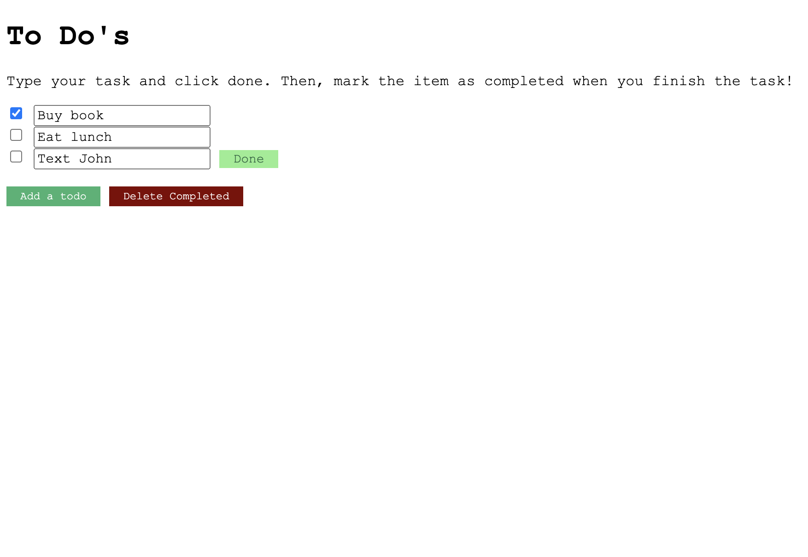

# Design Document
[//]: # (<<<<<<< HEAD)
[//]: # (### Design decisions, including rationale &#40;include images&#41;)

[//]: # ()
[//]: # (### Alternative designs we considered, including images)

[//]: # (=======)
### Design decisions
We followed the diagonal format, where the top few lines are longer and the bottom few lines are shorter.

[//]: # (![Diagonal format]&#40;diagonal.png&#41;)

We also clumped together all the tasks, since they are associated together, with the completed tasks on top.

### Alternative designs
We decided to use green for the "Done" and "Add" buttons,
since green is associated with growing, natural, and successful. 
Similarly, we used red for the "Delete completed" button, since apps typically use green for yes and red for no.

[//]: # (>>>>>>> 2313ce5d6f6d0d1b063e67c572bb022301b3bb2d)
### User testing
### Challenges we faced
We had a bit of trouble in the beginning with getting used to pulling before doing any work and pushing after completing some tasks.
### Parts of the design we're most proud of