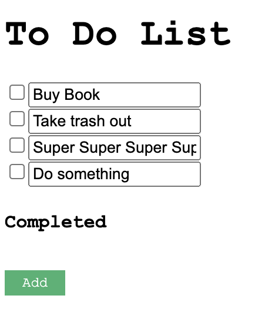

# Design Document
[//]: # (<<<<<<< HEAD)
[//]: # (### Design decisions, including rationale &#40;include images&#41;)

[//]: # ()
[//]: # (### Alternative designs we considered, including images)

[//]: # (=======)
### Design decisions
Starting with the way we structured our todo list, we decided to split the list into completed and uncompleted tasks. This is so the reader can get a better understanding of which tasks are completed and which are uncompleted.

We also decided to customize when to show the Completed header and the Delete Completed button. So, now when there are no tasks in the completed section, the completed header and the deleted button disappear.
So, we changed it from:

to:

### Alternative designs
We considered using pop-up messages for adding and deleting todos, but then we decided on just having a pop-up message for when the user wants to delete all completed tasks in case the user accidentally presses it.

[//]: # (>>>>>>> 2313ce5d6f6d0d1b063e67c572bb022301b3bb2d)
### User testing
We tested with the same potential user as last time, and she liked that we changed from "Add a todo" to "Add." She also 
enjoyed that the "Done" button no longer exists, which she mentioned last time as redundant. 

We also tested with another user who mentioned the text size and overall app was too small, so we increased all the components' sizes.

### Challenges we faced
We decided to introduce a whole new section "Completed," which shows all the items that are marked as completed. This
posed some challenges because we had to implement more constructors to keep track of all the different todos. Additionally, managing
the various props and states were quite confusing. But, after going to a couple grutoring sessions, we debugged all of our challenges.

### Parts of the design we're most proud of
As was the case last time, we feel proud of the simplicity of the color and structure, which leads to the ease of
understanding and using. Having "Completed" section also added a different layer to this app as a todo checker!